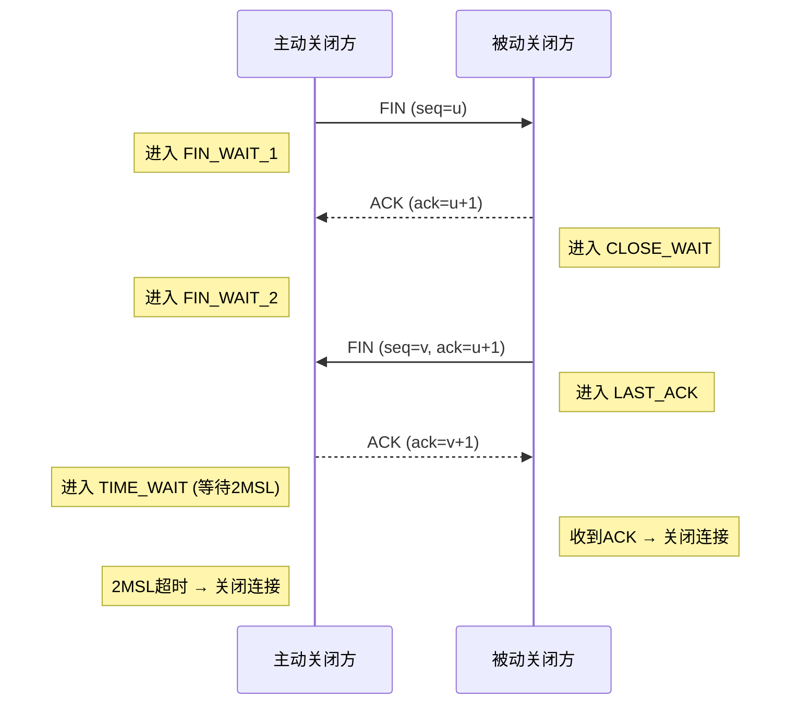
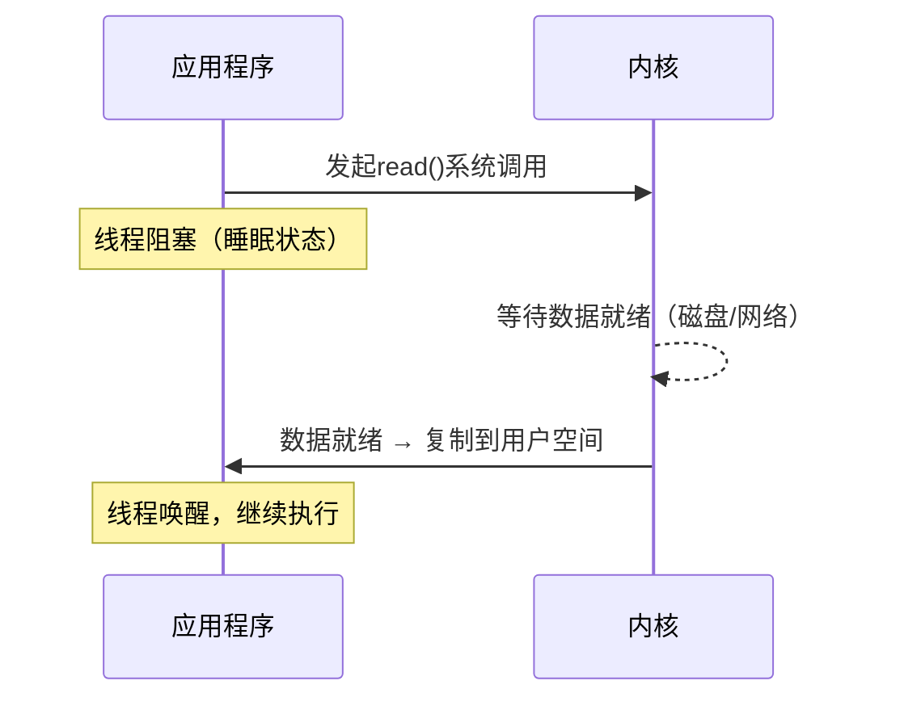
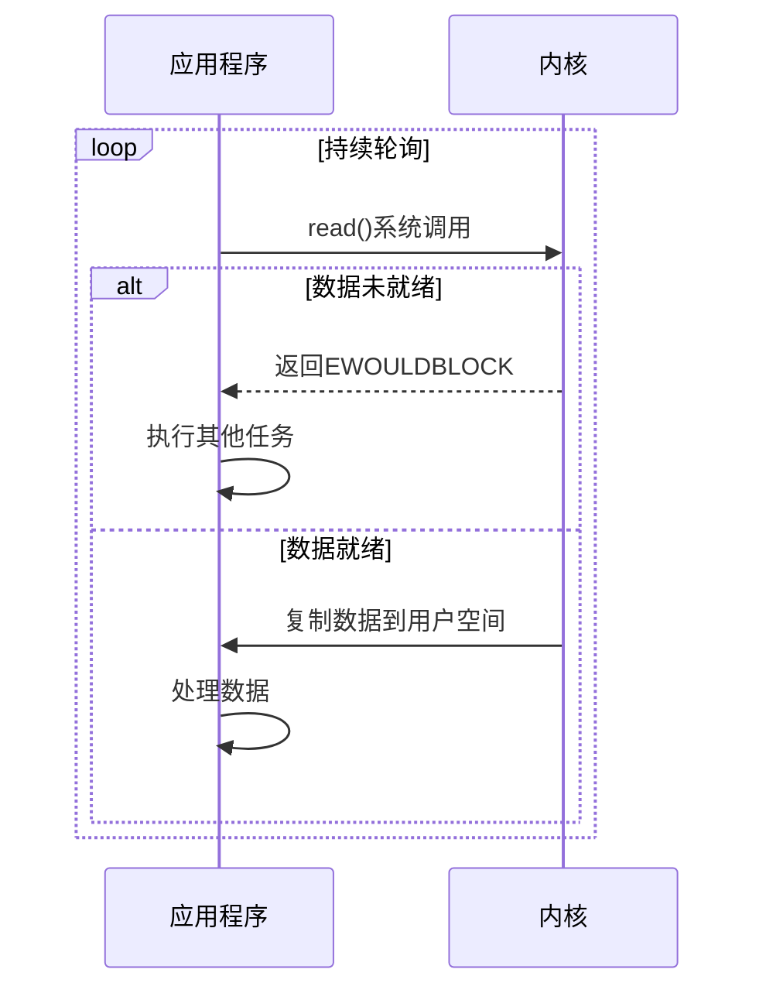
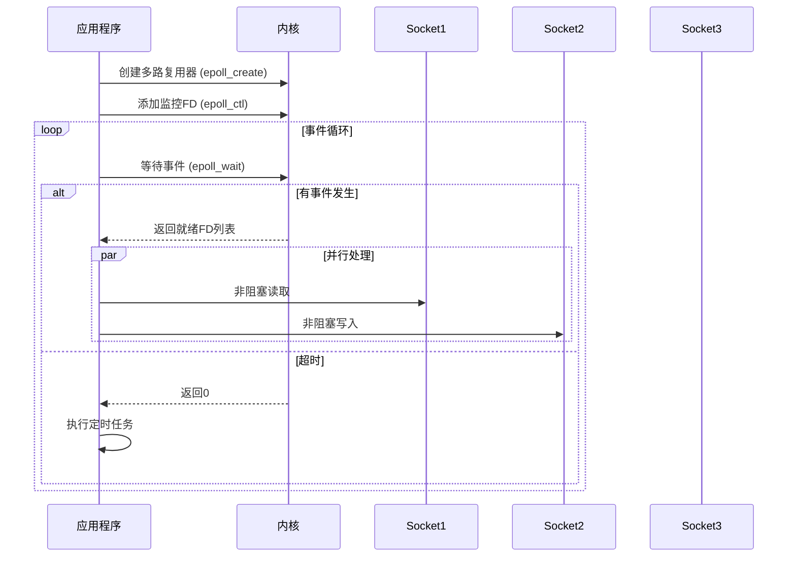
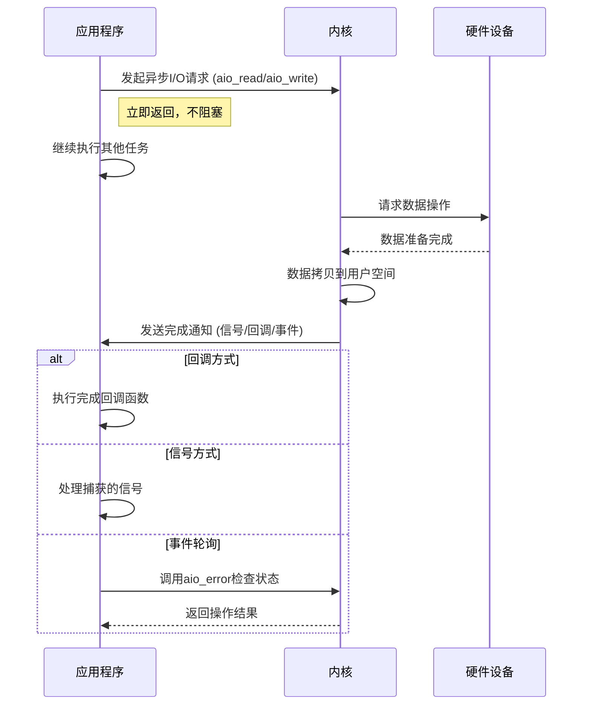
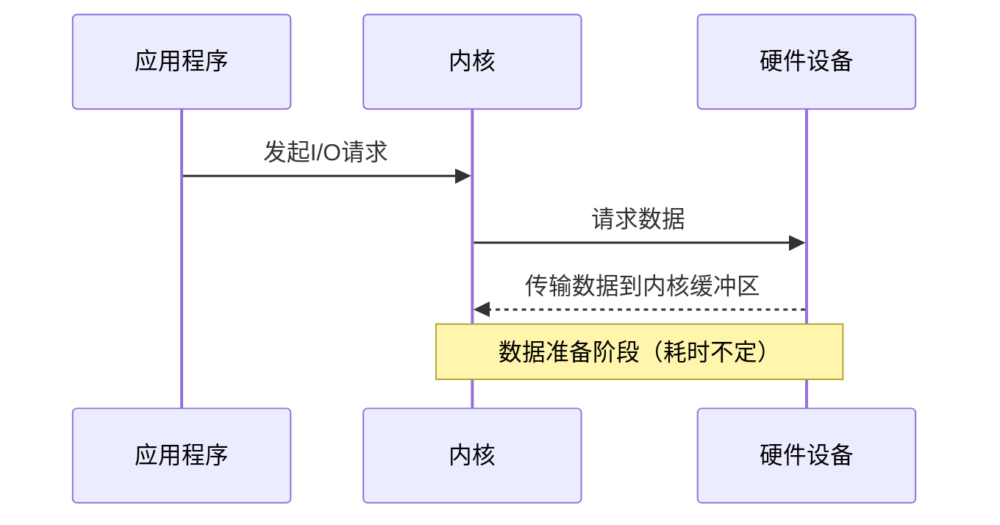
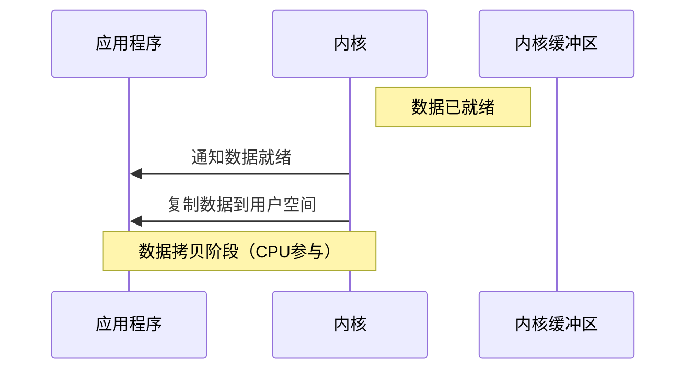
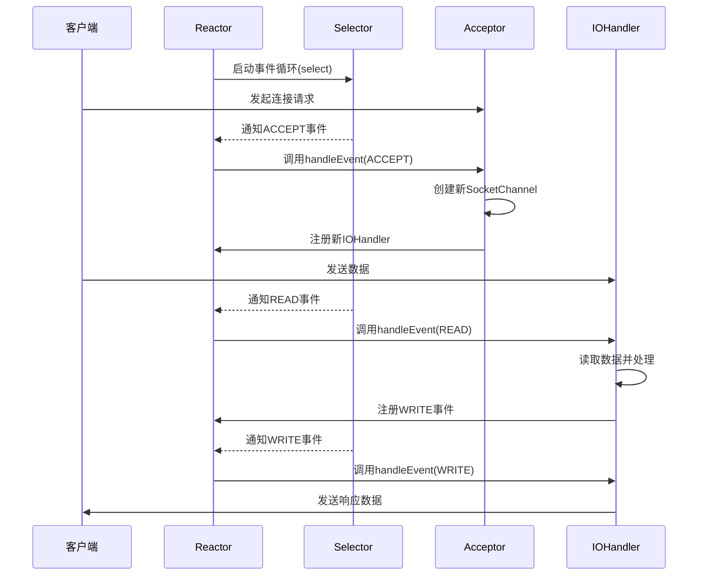
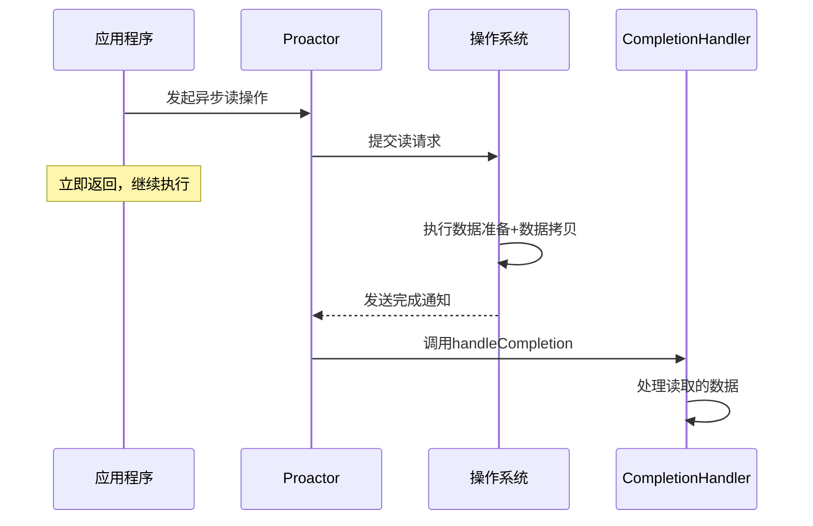

## 网络编程

###### 1.三次握手与四次挥手

第一次握手是客户端connect连接到server

第二次server accept client的请求之后，向client端发送一个消息，相当于说我都准备好了，你连接上我了

第三次 就是client向server发送的，就是对第二次握手消息的确认。之后client和server就开始通讯了。

断开连接的一端发送close请求是第一次握手

另外一端接收到断开连接的请求之后需要对close进行确认，发送一个消息，这是第二次握手

发送了确认消息之后还要向对端发送close消息，要关闭对对端的连接，这是第3次握手

而在最初发送断开连接的一端接收到消息之后，进入到一个很重要的状态time_wait状态，这个状态也是面试官经常问道的问题，最后一次握手是最初发送断开连接的一端接收到消息之后。对消息的确认。

###### 2.tcp和udp的区别

TCP：是面向连接的流传输控制协议，具有高可靠性，确保传输数据的正确性，有验证重发机制，因此不会出现丢失或乱序。

UDP：是无连接的数据服务，不对数据报文进行检查与修改，无须等待对方的应答，会出现分组丢失、重复、乱序，但具有较好的实时性，UDP段结构比TCP段结构简单，因此网络开销也小。

###### 3.IO模型

1）阻塞IO模型

​	最传统的一种IO模型，即在读写数据过程中会发生阻塞现象。

​	当用户线程发出IO请求之后，内核会去查看数据是否就绪，如果没有就绪就会等待数据就绪，而用户线程就会处于阻塞状态，**用户线程交出CPU**。当数据就绪之后，内核会将数据拷贝到用户线程，并返回结果给用户线程，用户线程才解除block状态

2）非阻塞IO

​	当用户线程发起一个read操作后，并不需要等待，而是马上就得到了一个结果。如果结果是一个error时，它就知道数据还没有准备好，于是它可以再次发送read操作。一旦内核中的数据准备好了，并且又再次收到了用户线程的请求，那么它马上就将数据拷贝到了用户线程，然后返回。

所以事实上，在非阻塞IO模型中，用户线程需要不断地询问内核数据是否就绪，也就说**非阻塞IO不会交出CPU，而会一直占用CPU**。

3）多路复用IO（对应Java中的 NIO）

​	在多路复用IO模型中，会有一个线程不断去轮询多个socket的状态，只有当socket真正有读写事件时，才真正调用实际的IO读写操作。因为在多路复用IO模型中，只需要使用一个线程就可以管理多个socket，系统不需要建立新的进程或者线程，也不必维护这些线程和进程，并且只有在真正有socket读写事件进行时，才会使用IO资源，所以它大大减少了资源占用。

4)信号驱动模型

​	在信号驱动IO模型中，当用户线程发起一个IO请求操作，会给对应的socket注册一个信号函数，然后用户线程会继续执行，当内核数据就绪时会发送一个信号给用户线程，用户线程接收到信号之后，便在信号函数中调用IO读写操作来进行实际的IO请求操作。

5）异步IO（java中的AIO）

​	异步IO模型才是最理想的IO模型，在异步IO模型中，当用户线程发起read操作之后，立刻就可以开始去做其它的事。

​	而另一方面，从内核的角度，当它受到一个asynchronous read之后，它会立刻返回，说明read请求已经成功发起了，因此不会对用户线程产生任何block。

​	然后，内核会等待数据准备完成，然后将数据拷贝到用户线程，当这一切都完成之后，内核会给用户线程发送一个信号，告诉它read操作完成了。

​	也就说用户线程完全不需要实际的整个IO操作是如何进行的，只需要先发起一个请求，当接收内核返回的成功信号时表示IO操作已经完成，可以直接去使用数据了。

​	也就说**在异步IO模型中，IO操作的两个阶段都不会阻塞用户线程**，这两个阶段都是由内核自动完成，然后发送一个信号告知用户线程操作已完成。

​	前面四种IO模型**实际上都属于同步IO，只有最后一种是真正的异步IO**，因为**无论是多路复用IO还是信号驱动模型，IO操作的第2个阶段都会引起用户线程阻塞**，也就是内核进行数据拷贝的过程都会让用户线程阻塞。

###### 4.IO操作的两个阶段

1）数据准备阶段

​	本质：等待数据到达内核缓冲区

​	触发条件：网络数据包到达网卡

​			    硬盘控制器完成数据读取

​			    其他I/O设备数据就绪

2)数据拷贝阶段

​	本质：将数据从内核空间复制到用户空间

​	操作内容：内核缓冲区 —> 应用程序缓冲区

​			    系统调用完成

###### 5.Reactor与Proactor IO设计模式

1）Reactor设计模式

​	在**Reactor**模式中，会先对每个client注册感兴趣的事件，然后有一个线程专门去轮询每个client是否有事件发生，当有事件发生时，便顺序处理每个事件，当所有事件处理完之后，便再转去继续轮询，**多路复用IO就是采用Reactor模式。**

2)Proactor设计模式

​	在**Proactor**模式中，当检测到有事件发生时，会新起一个异步操作，然后交由内核线程去处理，当内核线程完成IO操作之后，发送一个通知告知操作已完成，可以得知，**异步IO模型采用的就是Proactor模式。**

###### 6.Java NIO中的Buffer是什么？如何使用？

Buffer(缓冲区):Java NIO Buffers用于和NIO Channel交互。 我们从Channel中读取数据到buffers里，从Buffer把数据写入到Channels；

Buffer本质上就是一块内存区；一个Buffer有三个属性是必须掌握的，分别是：capacity容量、position位置、limit限制。

Buffer的常见方法：Buffer clear()、Buffer flip()、Buffer rewind()、Buffer position(int newPosition)

Buffer的使用方式/方法介绍:

分配缓冲区（Allocating a Buffer）:ByteBuffer buf = ByteBuffer.allocate(28);//以ByteBuffer为例子

写入数据到缓冲区（Writing Data to a Buffer）

写数据到Buffer有两种方法：1.从Channel中写数据到Buffer

​							int bytesRead = inChannel.read(buf); //read into buffer.

​						   2.通过put写数据：buf.put(127);

7.